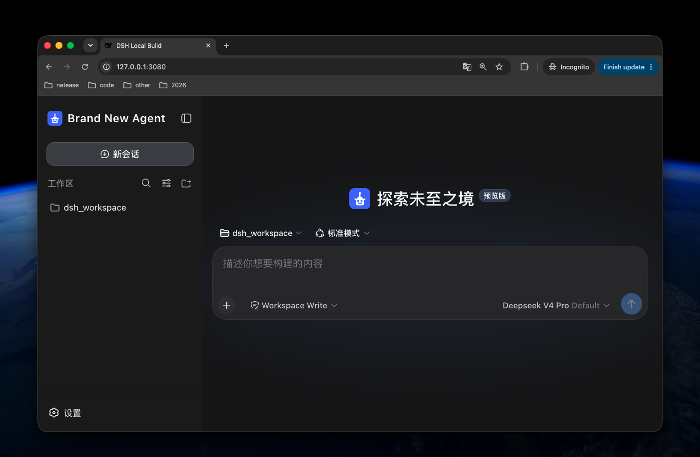

[English](README.md) | 中文

# dsh-client-ui-brand

这是一个非常简单的 DeepSeek Harness 插件。在不修改 DeepSeek Harness 源码的前提下，可以自定义产品品牌。

## 效果预览



## 功能

- 自定义展开侧边栏和浏览器标题中的产品名称；
- 自定义侧边栏和空会话中的产品图标；
- 配置产品图标时，同时自定义浏览器 favicon 和 PWA manifest；

插件会把配置的产品图标包装为透明的方形 SVG 画布；非方形图标会居中留白并保持原始比例，不会拉伸。DSH 运行期显示会话标题时，标题后缀仍会保持为配置的产品名称。
空会话中的 slogan 目前官方不接受 PR ，所以不能做到无损调整，等官方开放 dsh core 的 slot 后，本插件可以实现。

## 安装

将已发布的包安装到 Web profile：

```sh
dsh plugin --profile web add dsh-client-ui-brand
```

安装后请重启 DSH Web 进程。

## 配置

在后续 Web profile patch 中添加配置，通常是：

```text
$DSH_HOME/profiles/web/cordis.patch.yml
```

安装后的 bundle 默认使用 **Brand New Agent** 和内置 Agent 图标。所有配置项均可选；仅在需要覆盖默认值时，才添加后续 profile patch：

```yaml
- id: dsh-client-ui-brand
  config:
    productName: Acme Agent
    logoUrl: https://cdn.example.com/branding/acme-agent.svg
    logoAlt: Acme Agent logo
```

### 配置项

| 配置项 | 默认值 | 说明 |
| --- | --- | --- |
| `productName` | `Brand New Agent` | 侧边栏产品名称、浏览器标题和 PWA 名称。 |
| `logoUrl` | 未设置 | 用于产品图标、favicon 和 PWA 图标的 HTTPS URL、同源绝对路径或 `data:image/...` URL。 |
| `logoPath` | 未设置 | 由 DSH 提供、用于产品图标、favicon 和 PWA 图标的本地图像绝对路径。 |
| `logoAlt` | `productName` | 图标无障碍文本。 |

`logoUrl` 和 `logoPath` 只能配置其中一个。

### 本地图标

```yaml
- id: dsh-client-ui-brand
  config:
    productName: Acme Agent
    logoPath: /absolute/path/to/acme-agent-logo.svg
    logoAlt: Acme Agent logo
```

本地文件只会通过固定路径提供：

```text
/plugins/dsh-client-ui-brand/brand-logo
```

配置产品图标后，插件会在以下固定路径提供方形品牌图、生成的 PWA manifest，并替换 Web Shell 原有的 favicon 与 manifest 链接：

```text
/plugins/dsh-client-ui-brand/brand-mark.svg
/plugins/dsh-client-ui-brand/manifest.webmanifest
```

未配置产品图标时，Web Shell 保留默认 favicon 和 manifest。

为保证安全，`logoPath` 必须是绝对路径、非符号链接的普通文件，扩展名只能为 `gif`、`jpeg`、`jpg`、`png`、`svg` 或 `webp`。该路径只接受 `GET` 和 `HEAD` 请求，不会读取请求中提供的文件路径；配置文件无法读取时返回 `404`，响应带有 `no-store` 和 `nosniff` 头。

## 许可证

MIT
